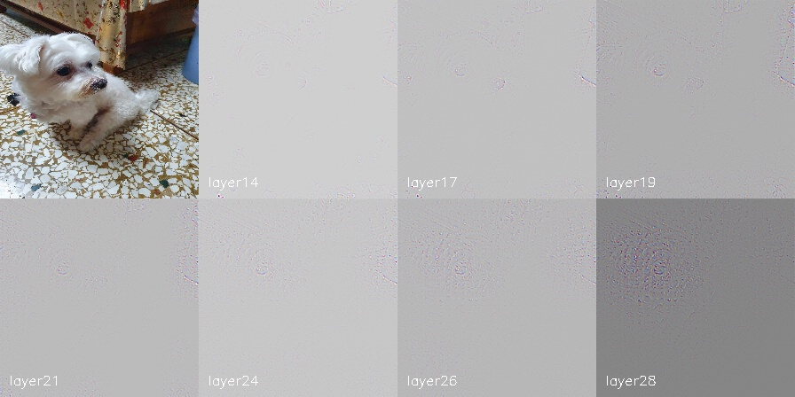

# Visualizing_CNN
## Resouces:
- VGG16 output labels: https://s3.amazonaws.com/deep-learning-models/image-models/imagenet_class_index.json
- [VGG net](https://pytorch.org/vision/stable/models/vgg.html) from Pytorch
- [VGG pretrained weights](https://pytorch.org/vision/stable/models/generated/torchvision.models.vgg16.html#torchvision.models.VGG16_Weights)
## Result
</img>
